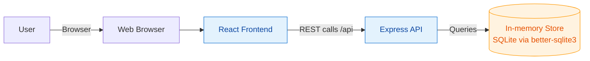
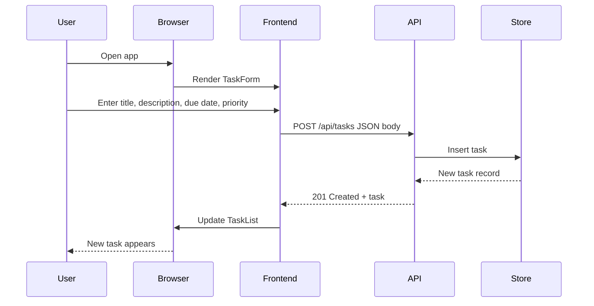

# Cloud/System Architecture Overview

This project is a monorepo with a React frontend and an Express API backed by an in-memory data store. The diagram below shows the high-level system context used during development.

- React app runs in the browser and invokes API endpoints under `/api/*`.
- Express API handles CRUD for tasks and reads/writes to an in-memory SQLite store.
- Local development defaults: API on port 3030; frontend dev server proxies `/api` to the backend.

## Sequence: Create TODO

